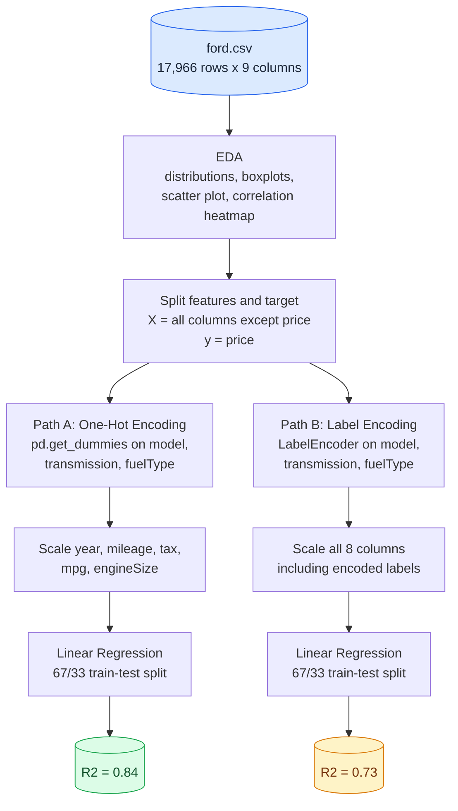
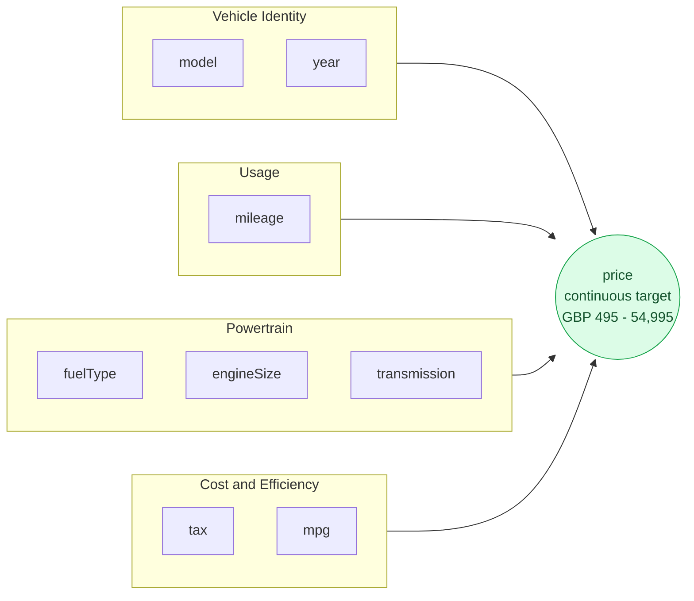

# 🚗 Ford Used Car Price Prediction

*Repository: `ford-prediction-model`*

An end-to-end regression pipeline predicting used Ford car prices from UK listing data — EDA, a head-to-head comparison of two categorical-encoding strategies, and a trained Linear Regression baseline reaching **R² ≈ 0.84**.


-brightgreen)

## Table of Contents
- [Overview](#overview)
- [Dataset](#dataset)
- [Repository Structure](#repository-structure)
- [Project Workflow](#project-workflow)
- [Feature Overview](#feature-overview)
- [Methodology](#methodology)
- [Results](#results)
- [Key Findings](#key-findings)
- [Getting Started](#getting-started)
- [Tech Stack](#tech-stack)
- [Project Status & Roadmap](#project-status--roadmap)
- [Notes & Recommendations](#notes--recommendations)
- [License](#license)
- [Acknowledgments](#acknowledgments)

## Overview

This project predicts the price of used Ford cars (17,966 UK listings) from their listing attributes. Unlike a pure EDA exercise, the notebook — `fordmodel.ipynb` — goes all the way to a trained model, and runs a small built-in experiment comparing **two different ways of encoding categorical features** before picking a winner:

1. **Exploratory Data Analysis** — distributions, boxplots, correlation heatmap
2. **Feature/target split** — `X` (everything except `price`) and `y` (`price`)
3. **Two parallel encoding paths** — one-hot encoding vs. label encoding
4. **Feature scaling** — applied differently on each path
5. **Linear Regression**, trained and scored separately on both paths

|  |  |
|---|---|
| **Rows** | 17,966 (154 exact duplicates present, not removed) |
| **Predictors** | 8 raw columns → 16 (one-hot) or 8 (label-encoded) |
| **Target** | `price` (GBP, continuous) |
| **Task type** | Regression — a baseline model has been trained and evaluated |
| **Best result** | **R² = 0.840** (one-hot encoding + Linear Regression) |
| **Environment** | Python 3.11.9, Jupyter Notebook |

## Dataset

The data lives in [`ford.csv`](./ford.csv) — 17,966 rows × 9 columns, one row per used-car listing. It's the Ford subset of the **100,000 UK Used Car Data Set**, a collection of scraped UK used-car listings split by manufacturer.

| Column | Type | Description | Range / Values |
|---|---|---|---|
| `model` | category | Ford model name | 24 distinct values (see note below) |
| `year` | int | Registration year | 1996 – 2020, plus one row recorded as `2060` |
| `price` | int | Advertised price (GBP) — **target variable** | £495 – £54,995 |
| `transmission` | category | Gearbox type | `Manual` (15,518), `Automatic` (1,361), `Semi-Auto` (1,087) |
| `mileage` | int | Recorded mileage | 1 – 177,644 |
| `fuelType` | category | Fuel type | `Petrol` (12,179), `Diesel` (5,762), `Hybrid` (22), `Electric` (2), `Other` (1) |
| `tax` | int | Annual road tax (GBP) | 0 – 580 |
| `mpg` | float | Fuel economy (miles per gallon) | 20.8 – 201.8 |
| `engineSize` | float | Engine displacement (litres) | 0 – 5.0 (`0` appears 51 times, see note below) |

No values are missing, but the raw file has a few data-quality quirks the notebook doesn't currently address:
- **154 exact duplicate rows** are present in the file.
- **One row has `year = 2060`** — almost certainly a data-entry error.
- **`model` has an inconsistent leading space**: `" Focus"` appears 4,588 times, while `"Focus"` (no leading space) appears once — as far as any encoder is concerned, these are two different categories.
- **`engineSize = 0`** appears in 51 rows, the great majority of them `Petrol` (45) or `Diesel` (5) — a real petrol or diesel engine can't have zero displacement, so this looks like a placeholder for a missing reading rather than a genuine value.

## Repository Structure

```
ford-prediction-model/
├── fordmodel.ipynb   # Main analysis notebook: EDA → encoding experiment → Linear Regression
├── ford.csv          # Raw dataset (17,966 records, 9 columns)
└── README.md         # Project documentation (this file)
```

## Project Workflow

The diagram below traces what the notebook actually does, including the fork into two competing encoding strategies. Diagrams are written in [Mermaid](https://mermaid.js.org/) and render automatically on GitHub/GitLab.



**Reading the diagram:** the blue cylinder is the raw data going in. After EDA and the feature/target split, the pipeline **forks into two independent experiments** — one-hot encoding (Path A) versus label encoding (Path B) — each with its own scaling step and its own Linear Regression model. The two colored cylinders at the end are the actual R² scores the notebook produced: green for the clear winner (one-hot, 0.84), amber for the weaker approach (label encoding, 0.73).

## Feature Overview

This second diagram groups the 8 raw predictors by what they describe about the car, and shows how they all feed into the price target.



**Reading the diagram:** the four boxes are the natural feature families in a used-car listing — what the car fundamentally is, how heavily it's been used, what powers it, and its running costs/efficiency. All four groups flow into the green `price` node, the continuous outcome every feature is ultimately used to explain.

## Methodology

### 1. Exploratory Data Analysis
- Inspected shape, dtypes, and summary statistics (`.describe()`); confirmed there are no missing values
- Histogram (with KDE) of `price` — right-skewed, most listings cluster between roughly £8,000–£15,000
- Correlation heatmap across the numeric columns
- Box plots: `price` by `year`, `price` by `engineSize`, `price` by `transmission`, `price` by `fuelType`, `price` by `model`, `price` by `tax`, `price` by `mpg`
- Scatter plot of `mileage` vs. `price`

### 2. Feature/Target Split
- `X = df.drop(columns=['price'])`, `y = df['price']`

### 3. Encoding — two strategies compared head-to-head
- **Path A — One-hot encoding:** `pd.get_dummies(X, columns=['model','transmission','fuelType'], drop_first=True)`, then cast to `int` — expands the 8 predictor columns to 15 (16 including `price` in the full frame)
- **Path B — Label encoding:** scikit-learn's `LabelEncoder` applied independently to `model`, `transmission`, and `fuelType`, keeping the frame at 8 columns but replacing each category with an arbitrary integer

### 4. Feature Scaling
- **Path A:** `StandardScaler` applied only to the five continuous columns (`year`, `mileage`, `tax`, `mpg`, `engineSize`); the one-hot dummy columns are left as 0/1
- **Path B:** `StandardScaler` applied to **all eight** columns, including the label-encoded integers for `model`, `transmission`, and `fuelType`

### 5. Modeling
- A 67/33 train/test split (`random_state=42`) is created separately for each encoded feature set, so the comparison uses the same split ratio and seed both times
- A plain `LinearRegression` is fit on each, and scored with `r2_score` on the held-out test set

## Results

| Encoding strategy | Feature columns | R² (test set) |
|---|---|---|
| One-hot encoding | 15 | **0.840** |
| Label encoding | 8 | 0.731 |

**Takeaway:** one-hot encoding outperforms label encoding by a wide margin (+0.11 R²) on this dataset. That's expected — label encoding assigns each category (e.g. each `model` or `fuelType`) an arbitrary integer, and Linear Regression then treats that integer as if it carried real numeric/ordinal meaning, distorting the fit. One-hot encoding avoids this by giving every category its own independent coefficient.

> **Note:** the notebook imports `mean_absolute_error` and `mean_squared_error` but never actually calls them — only R² is reported for either model. See [Roadmap](#project-status--roadmap).

## Key Findings

**Correlation with `price`** (from the EDA heatmap):

| Feature | Correlation |
|---|---|
| `year` | 0.64 |
| `mileage` | -0.53 |
| `engineSize` | 0.41 |
| `tax` | 0.41 |
| `mpg` | -0.35 |

**From the plots:**
- **Age and mileage dominate.** Newer, lower-mileage cars are worth more — the classic used-car depreciation curve, and the strongest signal in the dataset.
- **Transmission tracks price:** median price is highest for `Automatic` (£15,698), then `Semi-Auto` (£13,689), then `Manual` (£10,991).
- **Fuel type shows a similar pattern**, though sample sizes vary a lot: `Hybrid` has the highest median price (£23,498, on just 22 listings), followed by `Electric` (£15,738, 2 listings), `Diesel` (£13,289, 5,762 listings), and `Petrol` (£10,800, 12,179 listings).
- **Higher `mpg` correlates with *lower* price** (-0.35) — not because efficiency itself is undesirable, but because small, economical models (e.g. Fiesta) are cheaper than larger or performance models (e.g. Mustang), which tend to have poorer fuel economy.

## Getting Started

### Prerequisites
- Python 3.11+ (developed and tested on 3.11.9)
- Jupyter Notebook or JupyterLab

### Installation
```bash
# 1. Clone or download this repository, then move into it
git clone <repository-url>
cd ford-prediction-model

# 2. (Recommended) create a virtual environment
python -m venv venv
source venv/bin/activate      # Windows: venv\Scripts\activate

# 3. Install dependencies
pip install numpy pandas seaborn matplotlib scikit-learn jupyter
```

### Usage
```bash
jupyter notebook fordmodel.ipynb
```
Run all cells top to bottom. Keep `ford.csv` in the same folder as the notebook — it's loaded with a relative path (`pd.read_csv('ford.csv')`).

## Tech Stack

| Library | Purpose |
|---|---|
| pandas | Data loading & manipulation |
| numpy | Numerical operations |
| seaborn | Statistical visualization |
| matplotlib | Plotting |
| scikit-learn | `get_dummies`-adjacent preprocessing (`LabelEncoder`, `StandardScaler`), `train_test_split`, `LinearRegression`, `r2_score` |

*(This notebook doesn't include a package-install cell, so no specific tested versions are recorded here — see the insurance/heart-disease projects in this series for versions captured on the same machine.)*

## Project Status & Roadmap

**Done:** EDA, a feature/target split, a genuine encoding experiment (one-hot vs. label encoding), feature scaling, and a Linear Regression baseline trained and scored on both encodings — with one-hot encoding identified as the better approach (R² = 0.84).

**Suggested next steps:**
- [ ] Compute MAE and RMSE (already imported, never used) for an error measure in actual pounds, not just R²
- [ ] Drop the 154 exact duplicate rows before splitting into train/test
- [ ] Fix the `year = 2060` data-entry error
- [ ] Normalize whitespace in `model` before encoding (`" Focus"` vs. `"Focus"` are currently treated as different categories)
- [ ] Investigate the 51 `engineSize = 0` rows as likely missing-value placeholders
- [ ] Try tree-based models (Random Forest, Gradient Boosting) — they often handle categorical splits and non-linear price effects better than plain Linear Regression
- [ ] Add k-fold cross-validation instead of a single train/test split, for a more robust R² estimate
- [ ] Wrap the encoder + scaler + model into an sklearn `Pipeline` to avoid re-fitting the same `StandardScaler` object twice
- [ ] Persist the trained model (e.g. `joblib.dump`) and add a `requirements.txt` / `environment.yml`

## Notes & Recommendations
- Both experiments use the same `train_test_split` ratio (67/33) and `random_state` (42), so the R² comparison between one-hot and label encoding is a fair, like-for-like comparison.
- In Path B, the same `scaler` variable is reused with `.fit_transform` after already being fit on Path A's numeric columns. Since `fit_transform` recomputes the scaler's statistics from scratch each call, this doesn't cause data leakage — but reusing one variable name for two different fitted scalers is worth cleaning up for clarity in a future revision.
- `.ipynb_checkpoints/` is a Jupyter autosave folder — consider adding a `.gitignore` so it isn't committed to version control.

## License
No license file is currently included in this repository, so default copyright applies (all rights reserved). If you'd like others to reuse or build on this work, consider adding an open-source license such as [MIT](https://choosealicense.com/licenses/mit/).

## Acknowledgments
- Dataset: **100,000 UK Used Car Data Set**, containing scraped UK used-car listings split by manufacturer (Audi, BMW, Ford, Hyundai, Mercedes, Skoda, Toyota, Vauxhall, VW); this project uses the Ford subset, [`ford.csv`](https://www.kaggle.com/datasets/adityadesai13/used-car-dataset-ford-and-mercedes).
